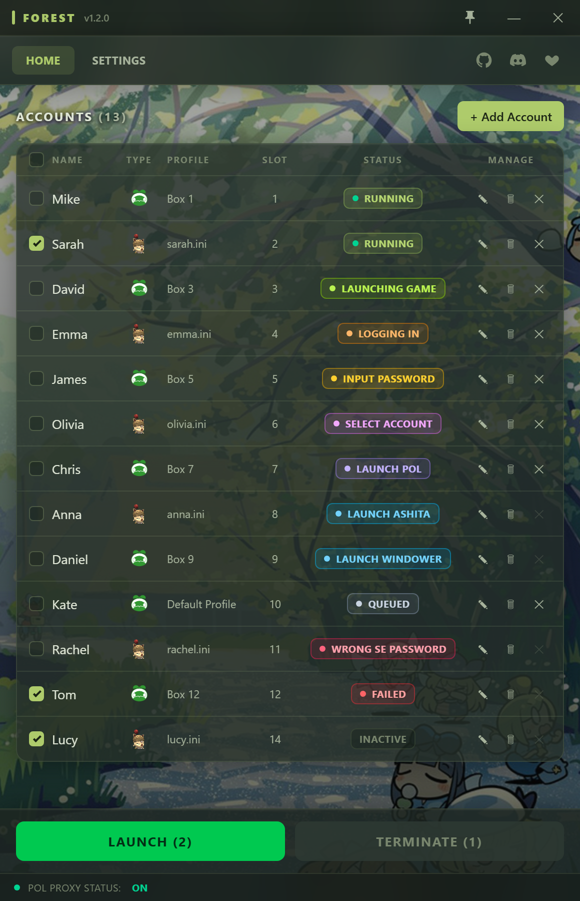

# Forest

  
  

  
   
  <em>Example of the main Forest UI.</em>

Fully automated PlayOnline login with multibox support, for Windower & Ashita v4, based on AutoPOL and POL Proxy.

Forest launches PlayOnline for one or multiple Final Fantasy XI accounts and logs
accounts in programmatically, so it does not require the window(s) to be focused.

## Support

Need help getting set up, run into a problem, or want the latest updates? **[Join the LesserEvil/Forest Discord](https://discord.gg/vSgYvdh8gT)**.

## Background

Forest was created last year around the time AutoPOL & POL Proxy were released but was never released to public until now. When I created Forest, I mainly wanted to create a tool that would make logging into multiple accounts easier and less cumbersome, and at the time AutoPOL didn't have the best support for 6boxer players specifically and the login_w.bin expansion modification didn't exist yet.

That's why I created Forest. I had a few specific goals I wanted to improve off of AutoPOL's base concept of automating logging on, those goals were:

- Create a more robust automation for logging into PlayOnline that does not rely on the user maintaining focus of the window.
- Disable PlayOnline UI during login process so the user doesn't even need to see or interact with it.
- Focused support for Multibox setups that require launching many accounts quickly.
- Have a Live Status display of accounts currently logged into the game in one place, allowing for quick and targetted termination.
- Automate POL Proxy usage and automate host file management so the user doesn't need to touch the hosts file at all.

## Features

- **Fully automated programmatic login** - Automated login that doesn't require the PlayOnline window to be focused. Login status can be seen through Forest's UI.
- **Native Multibox Support** - Launch many accounts at once or staggered with a delay.
- **Windower & Ashita v4** - Support for both by picking the launcher associated with an account.
- **Secure Credentials** - Passwords stored encrypted at rest with Windows
  DPAPI and only ever decrypted in-process.
- **POL Proxy Built-In** - POL Proxy is built in and hosts file is automatically managed by Forest (requires admin permissions).
- **And more...** - Per-account profiles with command line args to Windower/Ashita, drag-to-reorder accounts, launch/terminate multiple accounts simultaneously, live status, etc.

## Project Structure

### UI
Mainline GUI for Forest that allows users to manage their accounts.

### Trees
In-process module that injects into PlayOnline and drives automated actions on the POL process and window.

## Requirements
- Windows 10/11 (Other systems have not been tested)
- Windows, .NET 9 Runtime
- Final Fantasy XI Installed
- Windower and/or Ashita v4 Installed
- Run **as administrator** (Required for DLL Injection and POL Proxy)

## Download
Download the latest release at https://github.com/suspiciousman3187/Forest/releases/

## Usage

1. Launch `Forest.exe`.
2. **Settings** — set your Windower and/or Ashita-cli executable path.
3. **Add An Account(s)** — Name, SE password, PlayOnline member list slot slot, launcher type + profile (Windower)/boot config (Ashita).
4. Tick the accounts you want and click **LAUNCH**.

## Future Features

Automate One-time-password (Security Token) handling.
